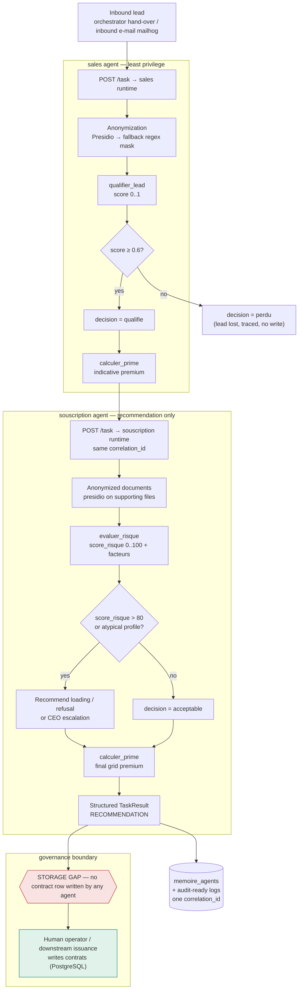

# CU-1 — Automated Underwriting and Commercial Workflow A: Lead to Contract with a Storage Gap

**System under documentation:** Assurance Toto digital twin — Buzz/Hermes bridge (`buzz-hermes-bridge`) + Hermes agent runtimes (`agents/_runtime`, `agents/sales`, `agents/souscription`) + PostgreSQL portfolio (`init.sql`, `schema_v2.sql`)
**Evidence class:** executable, unit-tested code paths (see §6). Every mechanism cited below exists in source covered by automated tests (`buzz-hermes-bridge/tests/*.test.ts` — 56 tests passing at the time of writing — and `agents/_runtime/tests/`).
**Terminology (mapping the French operational brief):** *souscription automatisée* = automated underwriting; *Workflow A* = the two-stage commercial pipeline (sales agent `sales` → underwriting agent `souscription`) that converts an inbound lead into an issuance-ready underwriting recommendation; *trou de stockage* = the storage gap described below (§5, §7).

---

## 1. Business Objective (Investor Framing)

**Operator takeaway:** Assurance Toto qualifies and prices an inbound car-insurance lead at machine speed, with zero human touch up to the point where a contract *could* be issued — and it does so while never letting an agent actually issue the contract.

For the business investor, CU-1 is the top-of-funnel counterpart to CU-2's claims lane. It automates the two highest-volume, lowest-judgment segments of the commercial chain:

- **Lead qualification** — scoring an outbound or inbound prospect against a deterministic Sales grid (`qualifier_lead`, score `0..1`, threshold `0.6`).
- **Risk assessment and indicative pricing** — computing a risk score (`evaluer_risque`, `0..100`, ceiling `80`) and a premium from the official grid (`calculer_prime`).

The commercial thesis rests on three code-backed properties:

1. **Operating-cost displacement.** The two workload segments above — historically the bulk of an underwriting desk's time on standard risks — are executed end-to-end by two cooperating agents with no human latency. A standard-risk lead moves from first contact to an issuance-ready recommendation in seconds.
2. **Risk containment by construction, not by procedure.** The underwriting agent **cannot issue a contract**. This is not a guideline in a manual; the agent's tool surface contains no write path (`agents/souscription/mcp-allowlist.json`: "Pas de règlement, pas d'écriture contrat (recommandation seulement)"; `agents/souscription/interface.md`: "NEVER issues the contract directly — only recommends"). All database-facing MCP access is read-only.
3. **Auditability of the conversion funnel.** Every qualifying decision, every risk score, and every premium figure is traceable to an agent task carrying one `correlation_id` (the ACPR-traceability contract stated in `agents/souscription/interface.md` and `agents/sales/interface.md`).

The system therefore sells a governed funnel: automation for the standard book, an explicit, auditable ceiling on what automation may decide, and a clean hand-off boundary where a human or a downstream system takes over.

---

## 2. How It Works in Real Time

The commercial pipeline spans two Hermes agent runtimes, each an independent process with its own least-privilege tool surface, configured by `agents/<role>/hermes.config.json`. Both run a local Ollama model (`gemma4:e4b`) — no paid external API.

### Step 1 — Lead intake and qualification (sales agent)

1. **Task intake.** The sales agent receives a task via `POST /task {"title","description","correlation_id"?}` (runtime route: `agents/_runtime/src/server.ts:79-88`). Typical triggers: the orchestrator hands over a lead, or an inbound e-mail is polled (`mailhog`, declared in the sales MCP allowlist).
2. **PII anonymization before any model call.** Prospecting data (e-mail, telephone) passes through the anonymizer (`agents/_runtime/src/privacy/anonymize.ts`): Microsoft Presidio when reachable (`presidio-analyzer` service), deterministic regex masking as local fallback. The confidentiality rule is contractual at the interface level (`agents/sales/interface.md`: "All PII ... is anonymized BEFORE LLM processing").
3. **Qualification.** The local model invokes exactly the tools its allowlist permits (`agents/sales/mcp-allowlist.json`): `qualifier_lead`, `calculer_prime`, `lire_client`, `lire_contrat`, `consulter_memoire`. `qualifier_lead` is deterministic: it scores `{age_conducteur, bonus_malus, type_vehicule, zone, source}` to `0..1` and returns `{score, decision: "qualifie"|"perdu"}`; the operative threshold is `score_qualification_min = 0.6` (`agents/sales/hermes.config.json`). The tool itself describes the boundary (registry definition, `agents/_runtime/src/tools/tools.ts:373+`): ">0.6 = 'qualifie', else 'perdu'".
4. **Indicative quote.** For a qualified lead, `calculer_prime` returns `{prime_annuelle_eur, base_eur, facteurs}` — explicitly indicative: the sales interface notes that the final rate falls to Underwriting (`agents/sales/interface.md`).
5. **Traceability.** The `correlation_id` propagates to the agent's structured logs and to `memoire_agents` rows written by `consulter_memoire` bookkeeping (`agents/_runtime/src/tools/tools.ts`), keyed by department (`sales`).

### Step 2 — Underwriting analysis (souscription agent)

1. **Hand-over.** The orchestrator (or an operator, or an upstream workflow) posts a new task to the underwriting agent's runtime, reusing the same `correlation_id` — e.g. `"analyze the risk of the qualified lead"` (`agents/souscription/interface.md`, Inputs).
2. **Anonymized supporting documents.** `mcp-postgres` (read-only) plus `presidio` anonymize any supporting document before it reaches the model (`agents/souscription/mcp-allowlist.json`).
3. **Risk scoring.** `evaluer_risque` returns `{score_risque: 0..100, decision: "acceptable"|"surprime_ou_refus", facteurs[]}`. The hard business rules are configuration, anchored in `agents/souscription/hermes.config.json` (`score_risque_max: 80`) and in the interface rules:
   - score `> 80` → recommend premium loading or refusal;
   - atypical profile (no-claims bonus `> 2.5`, or sports car with driver `< 25` years) → recommend escalation to the chief executive;
   - `escalation_eur: 5000` marks the monetary ceiling above which the matter is not decided by the agent.
4. **Final grid pricing.** `calculer_prime` applies the official pricing grid (`agents/souscription/skills/grille-tarification.md`) and returns the recommended final premium.
5. **Recommendation, not issuance.** The agent emits a structured `TaskResult`. No contract row is written. The `contrats` table (`infra/postgres/init.sql`) changes only through an operator action or a future issuance service — the **storage gap**, by design (§5, §7).

### The threshold grammar (deployment parameters)

| Side | Variable | Default | Enforced where |
|---|---|---|---|
| Sales qualification | `score_qualification_min` | 0.6 | `agents/sales/hermes.config.json` |
| Underwriting risk ceiling | `score_risque_max` | 80 | `agents/souscription/hermes.config.json` |
| Underwriting escalation ceiling | `escalation_eur` | €5,000 | `agents/souscription/hermes.config.json` |

These are **deployment parameters, not compiled code**: the operator re-prices its risk appetite by editing a config file and redeploying the agent container; no source change is required.

---

## 3. Flow Diagram



---

## 4. Validation / Reproduction

### 4.1 Bring the stack up and verify it

```bash
# From repository root
docker compose -f docker-compose.lite.yml up -d
docker compose -f docker-compose.lite.yml ps          # all services healthy

./scripts/healthcheck.sh                              # aggregate health gate
curl -s http://localhost:3100/readyz                  # bridge + Postgres + Buzz ready

curl -s http://localhost:8081/health                  # Buzz relay liveness (dedicated health port)
curl -s http://localhost:3002/                        # Buzz relay REST/web UI
```

> The compose manifest maps the Buzz relay as `3002:3000` (REST/UI) and `8081:8080` (dedicated health endpoints), and the bridge as `3100:3100` (`docker-compose.lite.yml`).

### 4.2 Seed a realistic portfolio (120 clients, 60 claims)

```bash
PGUSER=$PG_USER PGPASSWORD=$PG_PASSWORD PGDATABASE=$PG_DB PGHOST=127.0.0.1 PGPORT=$PG_PORT \
python infra/postgres/seed_faker.py --scale-maison
```

### 4.3 Drive Workflow A at the model level

Agent runtimes expose `GET /healthz`, `GET /readyz`, `POST /task` (`agents/_runtime/src/server.ts`). Per `docs/NETWORKING.md`, agents have **no published host port** (internal health on container port `4000`); calls travel the internal `net-dept` network. The portable, reproducible driver is therefore `docker compose exec` against the target container:

```bash
CID="11111111-2222-3333-4444-555555555555"

# Stage 1: qualify the lead (sales)
docker compose -f docker-compose.lite.yml exec -T agent-sales \
  curl -s -X POST http://localhost:4000/task -H 'Content-Type: application/json' -d '{
    "title": "Qualify inbound lead",
    "description": "Inbound web lead: 34-year-old driver, bonus-malus 0.85, city zone, diesel city car.",
    "correlation_id": "'"$CID"'"
  }'

# Stage 2: underwrite the qualified lead (souscription, same correlation_id)
docker compose -f docker-compose.lite.yml exec -T agent-souscription \
  curl -s -X POST http://localhost:4000/task -H 'Content-Type: application/json' -d '{
    "title": "Analyze risk of qualified lead",
    "description": "Lead qualified by sales (score 0.78). Compute final premium from the pricing grid.",
    "correlation_id": "'"$CID"'"
  }'
```

### 4.4 Verify the storage gap and the recommendation-only boundary

```bash
# The funnel produces recommendations and agent traces — no new contrats rows from agents.
docker compose -f docker-compose.lite.yml exec -T postgres psql -U "$PG_USER" -d "$PG_DB" -c \
  "SELECT departement, nature, correlation_id, created_at FROM memoire_agents \
    WHERE correlation_id='11111111-2222-3333-4444-555555555555' ORDER BY created_at;"
```

### 4.5 Audit and code verification

The bridge's own audit chain (verifiable at any time) is the same mechanism any downstream approval on this funnel feeds into:

```bash
curl -s http://localhost:3100/audit/verify
```

Automated regression coverage proving the mechanisms described above:

```bash
cd buzz-hermes-bridge && npm test    # pipeline / policy / schemas / http / dashboard — 56 passing
cd agents/_runtime && npm test       # runtime tools (incl. qualifier_lead, evaluer_risque, calculer_prime)
```

---

## 5. Bridge / Lifecycle — Maintainable Explanation

CU-1 exercises the *agent runtime* half of the platform; the bridge is the governance backbone the funnel reporting flows into. The two halves are deliberately separable:

- **The runtime is a closed tool surface.** `agents/_runtime/src/tools/tools.ts` builds a registry of rigidly-typed JSON-schemas; the model can only invoke what the per-agent `mcp-allowlist.json` permits, and every tool executes against injected `ToolDeps` (database, bridge client, anonymizer, thresholds). Changing a business rule (threshold, grid factor) means editing config or a skill document under `agents/<role>/skills/`, not the transport.
- **Agents never write business tables.** Both commercial agents hold only read-oriented tools plus memory (`consulter_memoire`); there is no `ecrire_contrat`, no settlement, no approval-issuing tool. This is the load-bearing fact behind the storage gap: it is not missing code, it is an absence of capability that the allowlist files make explicit and auditable (`agents/sales/mcp-allowlist.json`, `agents/souscription/mcp-allowlist.json`).
- **The bridge owns effect-bearing decisions.** When the funnel eventually hands off to a human-signed or escrow decision (pricing exception, kill-switch), the command grammar is the six closed JSON schemas of `buzz-hermes-bridge/src/commands/schemas.ts` and the fixed pipeline order of `buzz-hermes-bridge/src/pipeline.ts` (schema → idempotency → role → kill-switch → policy → atomic consumption → audit → transactional effect). A pricing exception, if ever granted for a CU-1 lead, travels as `policy.pricing.exception.approve` through that pipeline.
- **Lifecycle of a CU-1 recommendation:** task → anonymize → tool calls → structured `TaskResult` → logs + `memoire_agents` keyed by one `correlation_id`. Nothing is persisted to `contrats` until an actor *outside* the agent boundary writes it.

**Mental model for a new maintainer:** agents *recommend*, the bridge *disposes*, and only a human or a not-yet-built issuance service *writes contracts*.

---

## 6. Assurances (Court-of-Law Angle)

The evidentiary strength of CU-1 rests on five properties, each anchored in code:

1. **Delimited, auditable tool surface.** What an agent may do is a signed invariant: the union of `hermes.config.json` + `mcp-allowlist.json` + the typed registry (`agents/_runtime/src/tools/tools.ts`). A decision made by an agent is provably within-or-outside its mandate, because the mandate is machine-readable and version-controlled.
2. **PII never reaches a model unmasked.** The anonymizer (`agents/_runtime/src/privacy/anonymize.ts`) is invoked *before* the LLM loop; Presidio is a declared MCP dependency, not an optional call. This establishes, for any given task, that the model saw only redacted text — a decisive fact under GDPR when demonstrating data-minimization compliance.
3. **End-to-end correlation.** One `correlation_id` threads the sales qualification, the underwriting analysis, and any later bridge action, enabling a court or regulator to reconstruct the complete commercial incident in a single SQL query (§4.4, §4.5).
4. **Append-only, hash-chained auditability of downstream decisions.** If the funnel escalates into a bridge command (pricing exception, kill-switch), the record lands in the hash-chained, append-only `audit_log` (`infra/postgres/schema_v2.sql:72-101`) verifiable via `GET /audit/verify`. Editing or deleting a historical entry is detectable without trusting the operator.
5. **Documented human-in-the-loop boundary.** The interface contracts (`agents/souscription/interface.md`, rules section) define exactly which profiles require escalation (`score_risque > 80`, atypical profile, amount ceiling). The system therefore evidences not only what it decided, but *where it was forbidden from deciding*.

---

## 7. Known Limits / Caveats

- **The storage gap is intentional and currently manual.** No agent inserts into `contrats`. Contract issuance is an operator action (or a future issuance service). This is both the product's chief safety property and its current incompleteness: there is no automated workflow yet from "recommendation" to "contract row". Escalation to a chief executive is *recommended* by the underwriting agent; the bridge's signed-approval machinery exists for the adjacent claims lane (CU-2), not yet wired as a mandatory gate for underwriting recommendations.
- **Anonymization is best-effort.** Presidio recognizes a defined entity taxonomy; regex fallback covers common French patterns. An exotic identifier format could pass through unmasked. The fallback is logged (each redaction counted) but not guaranteed complete.
- **Thresholds are per-agent config, not consensus.** `score_risque_max`, `escalation_eur`, and `score_qualification_min` live in three config files. Divergence between sales and underwriting expectations would fail safe (a low-quality lead simply stalls between stages), but deployment automation should pin the grammar jointly.
- **LLM nondeterminism is bounded, not eliminated.** The local model may misclassify a borderline lead. It cannot exceed its tool surface, cannot issue a contract, cannot settle a claim, and the platform-wide kill-switch halts autonomy in one signed action — but a poor qualification within those bounds is possible.
- **No production identity on agent tasks.** `POST /task` accepts any caller on the internal network; there is no per-request authentication on agent runtimes (the bridge enforces Nostr signatures only on *command* ingress, not on task submission). Perimeter segregation (`docker-compose.lite.yml` network segmentation) is the current control; hardening is a Phase-3 item.

---

## Accountability Legend

- **Sales agent** — `sales` Hermes runtime (`agents/sales`); qualifies leads and computes indicative quotes; read-only on the portfolio; anonymizes prospecting PII.
- **Underwriting agent** — `souscription` Hermes runtime (`agents/souscription`); scores risk and computes the final grid premium; **recommendation only, never contract issuance**.
- **Orchestrateur** — hands tasks between departments (`agents/orchestrateur`); carries the `correlation_id` across Stage 1 → Stage 2.
- **Buzz/Hermes bridge** — governance backbone (`buzz-hermes-bridge`); owns every effect-bearing command and the hash-chained audit log; would authorize any pricing exception on a CU-1 lead.
- **Human operator / downstream issuance** — the only actor that writes the `contrats` table today; the endpoint of the storage gap.
