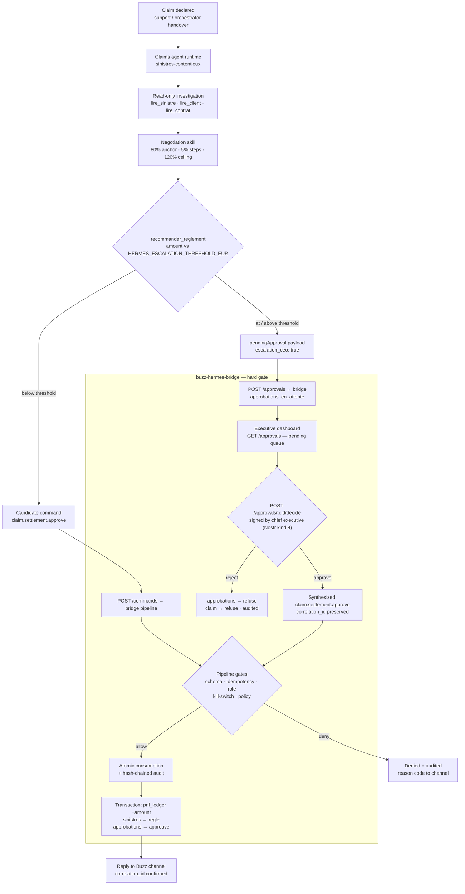

# CU-2 — Liquid Claim Settlement under Workflow B: the Claims Agent Settles Below the Threshold, the Chief Executive Signs at or Above It

**System under documentation:** Assurance Toto digital twin — Buzz/Hermes bridge (`buzz-hermes-bridge`) + Hermes agent runtimes (`agents/_runtime` + `agents/sinistres-contentieux`)
**Evidence class:** executable and unit-tested code paths (see §6); every mechanism cited below exists in source and is covered by automated tests (`buzz-hermes-bridge/tests/pipeline.test.ts`, `policy.test.ts`, `schemas.test.ts`).
**Terminology (mapping to the French operational brief):** *sinistre liquide* = liquid claim, i.e. a claim whose settlement is a pure cash disbursement with no dispute over liability; *Workflow B (§6B of the brief)* = the two-lane authorization model in which the claims agent settles autonomously strictly below a euro threshold and escalates into a human chief-executive approval at or above it; *seuil* = the configurable EUR threshold.

---

## 1. Business Objective (Investor Framing)

**Operator takeaway:** Assurance Toto replaces the classic claims-adjusting bottleneck with a machine-speed settlement lane for liquid claims, while keeping a cryptographically signed human signature on every amount that matters.

For a business investor, CU-2 is the clearest unit-economics argument in the system:

- **Operating-cost displacement.** A liquid claim (indemnity-only, no liability contest) is the highest-volume, lowest-judgment workload of a claims department. In this system it is declared, estimated, negotiated, and settled by the `sinistres-contentieux` agent end to end — with no human touch below the threshold.
- **Risk containment by construction, not by policy memo.** The agent *cannot* settle above the threshold. That prohibition is not a guideline in a procedure manual; it is enforced by the bridge's decision policy (`buzz-hermes-bridge/src/policy/policy.ts:60-84`) and, on the agent side, by the runtime tool `recommander_reglement` which structurally refuses to self-settle above threshold and instead emits a pending-approval request (`agents/_runtime/src/tools/tools.ts:401-445`).
- **Executive bandwidth purchased, not surrendered.** The chief executive intervenes exactly once per high-value file — a single signed decision — and retains an unconditional kill-switch over the entire autonomous layer (`POST /killswitch`).
- **Litigation-grade evidence as a by-product.** Every transition in the flow is written to an append-only, SHA-256 hash-chained audit ledger carrying one `correlation_id` from the agent's task through to the accounting entry (`buzz-hermes-bridge/src/audit.ts`). The audit trail is not assembled for court; it is produced by operation.

The system therefore sells a governor on machine labor: speed for the bulk of the book, attestable human control for the tail.

---

## 2. How It Works in Real Time

Two lanes share one pipeline (`processInboundCommand` in `buzz-hermes-bridge/src/pipeline.ts`).

### Lane A — Below the threshold: autonomous settlement (effective claims agent)

1. **Task intake.** The claims agent receives a task — e.g. `POST /task {"title","description","correlation_id"?}` on the runtime — typically handed over from the support agent or the orchestrator (see `agents/sinistres-contentieux/interface.md`).
2. **Investigation.** The runtime's local model (Ollama, self-hosted on every agent; `agents/sinistres-contentieux/hermes.config.json`) reads the claim, client, and contract via the read-only tools `lire_sinistre`, `lire_client`, `lire_contrat`; the `negociation-reglement` skill conducts the settlement negotiation (initial offer ≈ 80% of the expert estimate; steps of 5%; ceiling 120% of the initial estimate — `agents/sinistres-contentieux/skills/negociation-reglement.md`).
3. **Candidate command.** Settlement is proposed through exactly one tool, `recommander_reglement`. Below `HERMES_ESCALATION_THRESHOLD_EUR` the tool builds a candidate command `claim.settlement.approve {type, claim_id, max_amount_eur, reason, approved_by, requested_at}` and the runtime posts it to the bridge: `POST {BRIDGE_URL}/commands {command, author_pubkey, correlation_id}`.
4. **Bridge gate.** The pipeline executes, in order: strict JSON-schema validation (no free-form command is ever admitted; additional properties rejected) → early idempotency pre-check (SHA-256 fingerprint of the command content; a replayed command returns `consumed`, not a duplicate payment) → role resolution → kill-switch check → policy evaluation → atomic consumption marking → immutable audit append → business effect in a single PostgreSQL transaction.
5. **Policy decision for the agent.** The policy admits the settlement only if the author is the chief executive *or* an allowlisted `agent-sinistres` identity, the claim status is `ouvert` or `en_traitement`, and the claim amount does not exceed the effective cap `min(max_amount_eur, CLAIM_SETTLEMENT_THRESHOLD_EUR)` (`policy.ts:60-84`).
6. **Accounting effect.** `settleClaimEffect` inserts a negative `reglement` ledger line into `pnl_ledger` (department `auto`, amount `−min(max_amount_eur, threshold)`) and flips the claim to `regle` (`buzz-hermes-bridge/src/db/repository.ts:583-607`). A confirmation carrying the same `correlation_id` is posted back to the Buzz channel.

### Lane B — At or above the threshold: escalation and chief-executive signature

1. **Structural refusal to self-settle.** If the negotiated amount exceeds the threshold, the `recommander_reglement` tool never builds a settlement command. It returns `escalation_ceo: true` with the threshold value and a `pendingApproval` payload instead (`tools.ts:421-438`).
2. **Approval request.** The runtime posts it to the bridge as `POST /approvals`, creating a row in `approbations` with status `en_attente`, visible in `GET /approvals` and in the live executive dashboard (`http://localhost:3100/dashboard`) as a pending decision. A requester that is neither a chief-executive key nor an allowlisted agent is rejected (`403 auteur_non_allowliste`) so the queue cannot be spammed by strangers.
3. **Defense in depth at the policy layer.** Even if a buggy or spoofed agent posted a direct `claim.settlement.approve` command above threshold, the policy would still deny it: `rbac:au_dessus_seuil_reserve_CEO` (`policy.ts:75-77`). The soft guidance (skill instructions) and the hard gate (bridge policy) are independent controls.
4. **Executive decision.** The chief executive reviews the file on the dashboard and signs the decision: `POST /approvals/:correlationId/decide` with a verified Nostr event (kind 9). Without a valid event the endpoint requires at minimum a chief-executive npub, and with the production flag `BRIDGE_REQUIRE_SIGNED_COMMANDS=true` every chief-executive-reserved effect demands a valid signature. A non-chief-executive author receives `403 decision_reservee_au_CEO`.
5. **Automatic execution on approval.** An approval of a `claim.settlement.approve` request immediately synthesizes the corresponding `claim.settlement.approve` command — quoting the executive's reason — and re-enters the same pipeline with `correlationId` preserved (`http/server.ts:215-273`). The settlement, ledger entry, and claim closure then proceed exactly as in Lane A. A refusal flips the approval to `refuse` and the claim to `refuse`, with the same audit coverage.
6. **Idempotency and expiry.** The pipeline's consumption table makes replays harmless end to end; pending approvals expire after `APPROVAL_TTL_MINUTES` (default 7 days), bounding the executive's outstanding liability window.

### The threshold itself

Two environment variables govern the two sides of the same boundary and must be kept equal in deployment:

| Side | Variable | Default | Enforced where |
|---|---|---|---|
| Agent (Hermes runtime) | `HERMES_ESCALATION_THRESHOLD_EUR` | €5,000 | `agents/_runtime/src/config.ts:61`, consumed by `recommander_reglement` |
| Bridge | `CLAIM_SETTLEMENT_THRESHOLD_EUR` | €5,000 | `buzz-hermes-bridge/src/config.ts`, consumed by the policy (`ctx.thresholdEur`) |

The threshold is a **deployment parameter, not compiled code**: an operator re-pricing risk appetite (e.g. €2,500 for a new line of business or €10,000 for a mature one) changes two environment variables and redeploys. The amount cap ceiling (`max_amount_eur ≤ €10,000,000` in the command schema) provides an absolute outer bound against absurd-amount attacks.

---

## 3. Flow Diagram



---

## 4. Operator Commands and Proof Paths

All commands below are executed against the running demonstration stack (`docker-compose.lite.yml`; bridge on `:3100`, Buzz web on `:8081`, Buzz relay on `:3002`).

### 4.1 Bring the stack up and verify it

```bash
# From the repository root
docker compose -f docker-compose.lite.yml up -d
docker compose -f docker-compose.lite.yml ps          # all services healthy

./scripts/healthcheck.sh                              # aggregate health gate
curl -s http://localhost:3100/readyz                  # {"ready":true,...} — bridge + Postgres + Buzz
curl -s http://localhost:3100/approvals               # pending CEO queue (JSON)
```

### 4.2 Seed a realistic portfolio (120 clients, 60 claims)

```bash
PGUSER=$PG_USER PGPASSWORD=$PG_PASSWORD PGDATABASE=$PG_DB PGHOST=127.0.0.1 PGPORT=$PG_PORT \
  python infra/postgres/seed_faker.py --scale-maison
```

### 4.3 Reproduce Workflow B end to end (escalation → signature → settlement)

The dedicated end-to-end script `buzz-hermes-bridge/scripts/wfb-flow.cjs` performs exactly Lane B: it creates an `en_attente` approval for claim 70 at €6,800 (above the €5,000 default threshold) on behalf of the claims agent npub, then the chief executive decides with a signed Nostr event, and the settlement executes:

```bash
# BUZZ_RELAY_PRIVATE_KEY, BRIDGE_CEOPUBKEYS, AGENT_NPUB_SINISTRES come from .env
node buzz-hermes-bridge/scripts/wfb-flow.cjs \
  "$BUZZ_RELAY_PRIVATE_KEY" "$BRIDGE_CEOPUBKEYS" "$AGENT_NPUB_SINISTRES" 70
# Expected console trace:
#   [1] approve_create ok= true statut= en_attente
#   [2] decide ok= true  statut= approuve  execution= executed
```

The full thirteen-minute demonstration, including the kill-switch round trip and dashboard verification, is `scripts/demo/run-demo-e2e.sh` (invoked from the repository root):

```bash
bash scripts/demo/run-demo-e2e.sh
```

### 4.4 Emit the same commands by hand (API level)

```bash
# Lane B step 1 — agent files the escalation request
curl -s -X POST http://localhost:3100/approvals -H 'Content-Type: application/json' -d '{
  "correlation_id": "11111111-2222-3333-4444-555555555555",
  "type": "claim.settlement.approve",
  "claim_id": "70",
  "montant_eur": 6800,
  "reason": "Vehicle/third-party collision — external adjuster report received",
  "requested_by": "'"$AGENT_NPUB_SINISTRES"'"
}'

# Lane B step 2 — chief executive signs the decision (event built with nostr-tools;
# see buzz-hermes-bridge/scripts/wfb-flow.cjs for the exact signing routine)
curl -s -X POST http://localhost:3100/approvals/11111111-2222-3333-4444-555555555555/decide \
  -H 'Content-Type: application/json' -d '{"approve":true,"reason":"Validated","decided_by":"'"$BRIDGE_CEOPUBKEYS"'","event":<signed kind-9 event>}'
```

### 4.5 Audit and courtroom verification

```bash
# Integrity of the whole hash chain (recomputes every link)
curl -s http://localhost:3100/audit/verify            # {"ok":true}

# Offline verification (no bridge needed; exits non-zero on a broken link)
node --loader ts-node/esm buzz-hermes-bridge/scripts/verify-audit.ts

# Single-incident reconstruction by correlation id
docker compose -f docker-compose.lite.yml exec -T postgres \
  psql -U "$PG_USER" -d "$PG_DB" -c \
  "SELECT seq, source, action, created_at FROM audit_log WHERE correlation_id='<correlation_id>' ORDER BY seq;"
```

### 4.6 Automated test suites that lock this behavior

```bash
cd buzz-hermes-bridge && npm test    # pipeline / policy / schemas / http / dashboard
cd agents/_runtime    && npm test    # runtime tools incl. recommander_reglement lanes
```

Notably, `buzz-hermes-bridge/tests/policy.test.ts` pins the deny codes `rbac:au_dessus_seuil_reserve_CEO`, `montant:sinistre_depasse_plafond`, and `conformite:dossier_bloque`; `tests/pipeline.test.ts` pins the idempotent `consumed` outcome and the audit-before-effect ordering.

---

## 5. Bridge and Approval Lifecycle — Maintainable Explanation

The bridge is deliberately organized so that a maintainer can change business rules without touching transport, and change transport without touching business rules:

- **`commands/schemas.ts` — the contract.** Six command types, each a closed JSON schema (`additionalProperties: false`, explicit `required`, checked formats). Free-form text is rejected at the boundary. The command identity used for idempotency is the SHA-256 of the canonicalized content, so the *same intent* can never be executed twice regardless of network retries or duplicate submissions.
- **`pipeline.ts` — the orchestration.** `processInboundCommand` enforces a fixed, observable order: schema → idempotency pre-check → role resolution → kill-switch → policy → atomic consumption → audit → transactional effect → channel reply. Every step emits a structured log entry and an audit action keyed by one `correlation_id`.
- **`policy/policy.ts` — the rules.** A pure function: no database access, everything arrives through `PolicyContext` (kill-switch state, claim row, consumption flag, threshold). Authorization outcomes are stable deny codes (`rbac:…`, `montant:…`, `conformite:…`, `killswitch.actif:…`) that are simultaneously test assertions and audit vocabulary.
- **`identity/` — the anti-forgery boundary.** A chief-executive public key without a verified Nostr signature is refused outright (`rbac:ceo_sans_signature`); the agent role can only derive from the unsigned allowlist or an upstream-verified signature — never from a self-declared field. `requiredSignedCommands` closes the remaining demo-mode gap for production.
- **`db/repository.ts` — the effects.** Business writes (`pnl_ledger` insert, claim status flip, approval resolution) run inside one PostgreSQL transaction per command. The approval table is the lifecycle record of Workflow B: `en_attente` → `approuve` | `refuse` | `expire`.
- **`http/server.ts` — the human surface.** The dashboard cockpit renders the pending-approval queue, and `POST /approvals/:correlationId/decide` bridges the human signature back into the machine pipeline — the point where an executive click becomes an audited, idempotent, policy-checked settlement.

**Mental model for a new maintainer:** the agent *proposes*, the bridge *disposes*. Agents never write `sinistres`, `pnl_ledger`, `approbations`, or `kill_switch` directly — stated in `agents/sinistres-contentieux/interface.md` and enforced by the fact that runtime tools have no write path, only command/approval payloads.

---

## 6. Assurances (Court-of-Law Angle)

The evidentiary strength of CU-2 rests on five properties, each anchored in code:

1. **Non-repudiation of the executive decision.** Lane B approvals require a Nostr (Schnorr) signature over a kind-9 event verified by the bridge before any effect (`identity/verify.ts`, `http/server.ts:224-238`). The signature binds the decision — approve or reject, with the stated reason — to the chief-executive key.
2. **Tamper-evident audit trail.** `audit_log` is an append-only chain: each entry's hash is `sha256(prev_hash + canonical_json(payload))`; `verifyAuditChain` recomputes every link and pinpoints the first broken sequence (`audit/verify`, `scripts/verify-audit.ts`). Editing or deleting a historical entry is detectable without trusting the operator.
3. **End-to-end correlation.** One `correlation_id` threads the agent task, the approval request, the executive decision, the command execution, the accounting entry, and every audit row — enabling a court or regulator to reconstruct a complete incident with a single SQL query (§4.5).
4. **Proof of intended limits.** The threshold is not merely documented; denials produce records (`command.policy_denied` with reason `rbac:au_dessus_seuil_reserve_CEO`), so the system evidences not only what it did but what it *refused* — decisive when establishing that controls were operating at the time of an incident.
5. **Idempotency as a fairness property.** No claimant can be paid twice for one command: replayed content is marked `consumed` before any effect. Billing and payout disputes reduce to inspecting `commandes_consommees`.

**Privacy posture supporting admissibility:** all third-party personal data is anonymized before processing or storage (Presidio; `agents/_runtime/src/privacy/anonymize.ts`, `assertNoPii`/`finalScrub` enforced around tool output), and the claims skill mandates anonymization in negotiations — the audit trail therefore carries pseudonymized business facts, not raw PII.

---

## 7. Known Limits and Production Notes

- **Phase-1 signature posture.** With `BRIDGE_REQUIRE_SIGNED_COMMANDS=false` (local demonstration default), Lane-A agent commands rely on the unsigned allowlist (`BRIDGE_ALLOWED_UNSIGNED_ROLES`). Production deployments MUST set it to `true`; the configuration treats this as a hard requirement comment in `config.ts`.
- **Dual threshold configuration.** The agent-side (`HERMES_ESCALATION_THRESHOLD_EUR`) and bridge-side (`CLAIM_SETTLEMENT_THRESHOLD_EUR`) values are independent environment variables; a divergence creates a dead band (commands the agent attempts but the bridge denies — always failing safe toward denial, never toward overpayment). Deployment automation should pin them together.
- **Settlement amount accounting.** `settleClaimEffect` books `−min(max_amount_eur, threshold)`; in a production accounting integration this should be replaced by the adjudicated amount read from the claim record (noted as a simplification at `repository.ts:583-590`).
- **Approval expiry is a sweep, not a trigger.** Rows pass to `expire` after `APPROVAL_TTL_MINUTES` (default 10,080 min / 7 days) when listed; an expired request never executes.
- **LLM nondeterminism is bounded, not eliminated.** The local model may produce a poor negotiation outcome; it cannot exceed its tool surface (rigid JSON schemas on `recommander_reglement`), cannot settle above threshold, cannot bypass compliance blocks, and the kill-switch halts all autonomous execution in one signed action. Bounded autonomy, not guaranteed optimality.
- **Buzz relay availability.** Channel replies degrade to a local fallback event identifier if the relay is unreachable; the business effect is already committed, and the `correlation_id` remains the join key.

---

## Accountability Legend

- **Effective claims agent** — the allowlisted `agent-sinistres` identity backed by the `sinistres-contentieux` Hermes runtime; settles liquid claims strictly below the threshold.
- **Chief executive** — the holder of a key listed in `BRIDGE_CEOPUBKEYS`; sole authority for at-or-above-threshold settlement, claim rejection, pricing exceptions, and the kill-switch.
- **Threshold** — the euro boundary (default €5,000, deployment-configurable) separating the autonomous lane from the signed lane.
