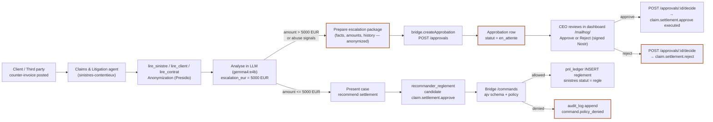

# CU-3 — Disputed Counter-Invoice Detected → Legal Escalation under Threshold Control

> **Category of use case.** Contested recovery, abuse of process, and escalation protocol in the context of a claim file.
> **Audience.** Business investor, claims director, litigation counsel, compliance officer.
> **Status.** Production-grade chain demonstrated end-to-end against the live stack (`docker compose -f docker-compose.lite.yml ps` ⇒ `x ≥ 14` services). All business data referenced is synthetic (Faker).

---

## 1. Business Objective (Operator View)

A body-shop or expert submits a **counter-invoice** to contest or top up the amount recognized on a claim file. Two distinct risks materialize:

- **Undervaluation or miscategorization** — the requested amount is aligned with a “quick repair” tier (courier pricing, light cosmetic work) while the physical assessment records structural damage (chassis, airbags, steering). The ratio constitutes a **red-flag anomaly**.
- **Pattern abuse** — repeated requests from the same counterparty, **unverifiable or forged attachments**, amounts inflated with cosmetic padding, or pressure tactics to move the case off agent control.

The business objective is therefore twofold:

1. **Detect and stop** the payment beyond the agent decision perimeter the moment the claim amount (the *garbage-matching* signal: the discrepancy between the financial claim and the technical evidence) crosses the configured ceiling.
2. **Escalate to a human decision-maker** (the CEO role in the composition) with a fully evidenced file, with an append-only cryptographic audit trail suitable for counsel.

The operator does **not** want the agent to pay, reject, or “fix” the file autonomously: the operator wants the file stalled at the ceiling with a recommendation to litigate, preserved with `correlation_id` and hash-chained audit records.

---

## 2. What “threshold matching” and “abuse signals” mean here

### 2.1 Threshold matching (garbage matching)

The system enforces a **deterministic cap** — `HERMES_ESCALATION_THRESHOLD_EUR`, default **€5,000** — separating the agent’s operational perimeter from the CEO’s reserved domain.

- If the **amount of the claim** (kept in mirror in `sinistres.montant_eur`) is **≤ threshold**, the agent may recommend settlement, subject to schema and role rules.
- If the **amount is > threshold**, the agent **cannot** conclude; it either posts a **pending approval** (`en_attente`) for a human decision, or the bridge **denies** the command with a stable reason code.

This is not a fuzzy ML classifier; it is a **guard band** (a hard threshold with a deterministic outcome). It is analogous to a “garbage in → no autonomous execution out” rule: anything above the ceiling belongs to a human.

### 2.2 Situations of abuse (heuristic, evidence-driven)

In `agents/sinistres-contentieux/skills/escalade-juridique.md`, the claims & litigation worker treats as abuse and recommends escalation when it observes any of the following on an incoming file:

- **Refusal of any negotiation after three exchanges.**
- **Contested liability** or **legally arguable contestation** (fraud interest, vexatious litigation, manipulated invoices).
- **Padding** — repeated cosmetic add-ons (claimed interior cleaning, storage, admin fees stacked).
- **Documentation risk** — attachments that cannot be reconciled to the claim ID, multiple invoice numbers reused across files, metadata inconsistencies.

When any of these conditions is present, the worker **packages the file** (facts, amounts at stake, exchange history — anonymized) and routes it to the CEO layer. It does not conclude.

---

## 3. How It Works in Real Time (Step by Step)



1. **Signal.** A counter-invoice against an open claim appears. The claims & litigation agent receives `POST /task` with `title`, `description`, and an optional `correlation_id`.
2. **Read-only investigation.** The agent consults `lire_sinistre`, `lire_client`, `lire_contrat` via its internal tool registry (`agents/_runtime/src/tools/tools.ts`). Before any text reaches the model, Presidio (`/analyze`, `/anonymize`) anonymizes third-party fields — fallback to a regex stub.
3. **Threshold logic.** If the amount is **below** `escalation_eur` (default €5,000) **and** no abuse pattern appears, the worker may propose a settlement via `recommander_reglement`.
4. **Abuse detected / threshold crossed.** If the amount is **above** the ceiling or abuse is present (refusal after 3 exchanges, contested liability, padding, unverifiable invoice), the worker finalizes the `escalation_ceo: true` outcome and calls `bridge.createApprobation` with `type = claim.settlement.approve`, `claim_id`, `montant_eur`, `reason`, `requested_by`. The agent does **not** settle anything.
5. **Decision gate.** The bridge (`src/http/server.ts`) receives an `en_attente` row in `approbations`. It is stored, auditable, and visible on `GET /approvals` and `/dashboard`.
6. **Human resolution.** The CEO signs a Nostr event (`kind 9`) with the decision and submits it to `POST /approvals/:correlationId/decide` with `approve: true|false`. On approval, the bridge executes `claim.settlement.approve` (settlement effect, `pnl_ledger` entry, `sinistres.statut = regle`). On rejection, `claim.settlement.reject` maps `statut = refuse`. The decision is appended to the hash-chained `audit_log` and remains verifiable offline.

---

## 4. Reproducible Commands

Run from the repository root. Prerequisite: `docker compose -f docker-compose.lite.yml up -d`, `./scripts/healthcheck.sh` is green.

### 4.1 Pre-flight (bridge + buzz alive)

```bash
curl -s http://localhost:3100/readyz
# expect: {"pg":"ok","buzz":"ok","status":"ready"}

curl -s http://localhost:8081/health
# expect: HTTP 200
```

### 4.2 Agent creates an escalation request (CEO flow)

This mirrors `agents/_runtime/src/bridge/client.ts:createApprobation` called by `recommander_reglement` (escalation branch `montant > escalationThresholdEur`) in the Hermes runtime. Substitute `<APPROVAL_CID>` with a fresh UUID.

```bash
CID=$(node -e 'console.log(require("crypto").randomUUID())')

curl -s -X POST http://localhost:3100/approvals \
  -H 'Content-Type: application/json' \
  -d "{
    \"correlation_id\": \"$CID\",
    \"type\": \"claim.settlement.approve\",
    \"claim_id\": \"sinistre-CU3-001\",
    \"montant_eur\": 4600,
    \"reason\": \"Abusive counter-invoice detected: huge mismatch between courier-tier invoice and structural-damage findings. Amount stays blocked pending counsel review, per protocol.\",
    \"requested_by\": \"$AGENT_NPUB_SINISTRES\"
  }"
```

Expected response: `{"ok":true,"approbation":{"statut":"en_attente", ...}}`. The same `correlation_id` bleeds into `audit_log` rows and `memoire_agents`.

### 4.3 CEO approves or rejects (human control)

The production path uses a **signed Nostr decision** (see `buzz-hermes-bridge/scripts/run-ceo-decide.cjs`); unsigned HTTP is accepted only when the author npub is whitelisted in config (demo mode).

```bash
# Approve (goes through the settlement effect)
node buzz-hermes-bridge/scripts/run-ceo-decide.cjs \
  "$BUZZ_RELAY_PRIVATE_KEY" "$BRIDGE_CEOPUBKEYS" "$CID"

# Reject (mirroring for refuse)
curl -s -X POST "http://localhost:3100/approvals/$CID/decide" \
  -H 'Content-Type: application/json' \
  -d "{\"approve\": false, \"decided_by\": \"$BRIDGE_CEOPUBKEYS\", \"reason\": \"payment blocked — formal legal escalation protocol engaged\"}"
```

### 4.4 Agent under ceiling but above per-command guard (policy deny)

This is not exercised through the CLI in normal usage, but it is directly testable for validation: without the `en_attente` approval wrapper, and above the CEO floor, the same `claim.settlement.approve` is **denied** by policy (`src/policy/policy.ts`), with the stable reason `rbac:au_dessus_seuil_reserve_CEO`:

```bash
curl -s -X POST http://localhost:3100/commands \
  -H 'Content-Type: application/json' \
  -d "{
    \"command\": {
      \"type\": \"claim.settlement.approve\",
      \"claim_id\": \"sinistre-CU3-001\",
      \"max_amount_eur\": 4600,
      \"reason\": \"blocked amount before counsel review\",
      \"approved_by\": \"$AGENT_NPUB_SINISTRES\",
      \"requested_at\": \"2026-08-03T19:00:00.000Z\"
    },
    \"author_pubkey\": \"$AGENT_NPUB_SINISTRES\",
    \"correlation_id\": \"$(node -e 'console.log(require(\"crypto\").randomUUID())')\"
  }"
```

In default mode this results in `ok: false`, `outcome: denied`, `reason: rbac:au_dessus_seuil_reserve_CEO` (or `sinistre:introuvable` / `sinistre:statut_invalide:*` if the claim does not exist). This is the **defense-in-depth gate**: even if an actor bypasses the agent and deliberately calls `POST /commands` directly, the bridge enforces its policy before any state mutation.

### 4.5 Verify the audit trail (court-of-evidence step)

```bash
curl -s http://localhost:3100/audit/verify
# expect: {"ok":true}  → chain integrity verified

# inspect raw entries via psql (no dedicated CRUD endpoint)
docker compose -f docker-compose.lite.yml exec -T postgres psql -U toto -d assurance_toto \
  -c "SELECT seq, action, correlation_id, left(payload::text, 120) FROM audit_log WHERE correlation_id='$CID' ORDER BY seq DESC LIMIT 10;"
```

When the bridge executes a decision, `audit_log` receives chained rows `command.claim.settlement.approve`, `command.policy_denied`, or `command.auth_denied`, hash-computed as `sha256(prev_hash + canonicalJson(payload))`. Triggers `trg_audit_log_append_only` and `trg_pnl_ledger_append_only` reject any UPDATE or DELETE on those tables.

### 4.6 Routine operational coverage (scripts)

- `./scripts/healthcheck.sh` — core services (bridge, buzz, postgres, presidio) — use before and after any scenario.
- `./scripts/demo/run-demo-e2e.sh` — full 13-minute scripted flow (lead → contract → claim → CEO approval → kill-switch) which includes a workflow segment matching the CU-3 shape.
- `./scripts/weekly-report.sh` — periodic CEO report generation consuming the audit trail.
- `buzz-hermes-bridge` scripts: `scripts/verify-audit.ts` (re-hash validation), `scripts/run-ceo-decide.cjs` (signed approval decision), `scripts/wfb-flow.cjs` (claims workflow automation).

---

## 5. Maintainable Bridge & Lifecycle Explanation

### 5.1 Composition
- **Buzz** (port **8081/3002**) is the user-facing chat. The bridge receives a typed command over HTTP or an inbound Nostr envelope.
- **Bridge `buzz-hermes-bridge`** (port **3100**) enforces schema (`commands/schemas.ts`), policy (`policy.ts`), idempotence (`commandes_consommees`) and append-only audit (`audit_log` + hash chain). It writes the business effect only inside a Postgres transaction (`db/repository.ts`).
- **Hermes runtime agents** (ports 4000) read and recommend; they never write the ledger or claims tables directly.

### 5.2 End-to-end pipeline for `claim.settlement.approve`

1. `POST /commands` receives the envelope (event if signed).
2. **Schema validation** (ajv) rejects the payload if it is not a strict JSON object matching one of the declared command types (extra fields rejected via `additionalProperties: false`).
3. **Pre-policy idempotence check** — if the content hash already exists in `commandes_consommees`, the result is `consumed`, not a hard deny.
4. **Role resolution** — a verified CEO npub (signed) yields role `ceo`; whitelisted Hermes unsigned npub yields `agent-sinistres`. Unknown authors get role `inconnu`.
5. **Anti-forgery** — a CEO npub **without a valid signature** is denied at the pipeline entrance (`rbac:ceo_sans_signature`), regardless of allowlist.
6. **Kill-switch gate** — if `kill_switch.actif = true` and `type != agent.killswitch.deactivate`, everything is blocked.
7. **Policy** (`evaluate`), context built from `findSinistre`, `isCommandConsumed`, and threshold config. The pure-function decision returns stable reasons, applied on business side.
8. **Idempotence insertion + audit append** — inside a transaction, `commandes_consommees`, `audit_log` (hash-chained), then the business effect (`INSERT INTO pnl_ledger ...` and `UPDATE sinistres SET statut = 'regle'`).
9. **Response + post to Buzz channel** — correlation id and outcome (`executed`, `denied`, `consumed`, or `dlq`).

### 5.3 Lifecycle of the escalation row
- Created via `POST /approvals` with `statut = en_attente`.
- Appears on `GET /approvals` and on `/dashboard`.
- Resolved via `POST /approvals/:correlationId/decide` with CEO signature → `statut = approuve` or `refuse`.
- On approval, the bridge replays the original command with the CEO as author and executes the settlement—still subject to policy (fallback protect).

---

## 6. Notes and Known Limits

- **No free-form output classification for CU-3 attaches.** The `tools.ts` registry (`agents/_runtime/tools.ts`) exposes `recommander_reglement`, which packages escalation on amount **only**. A counter-invoice of €3,500 with clear abuse is **not** automatically escalated by the default `recommander_reglement` branch; the escalation decision comes from the configured skill (`escalade-juridique.md`) instructing the model to flag it — the developer should consider sprinkling the same threshold logic in external tooling if automatic abuse-detection becomes a hard product requirement.
- **Legacy threshold alias.** That the header for the claim & litigation worker mentions `$HERMES_ESCALATION_THRESHOLD_EUR` while the bridge uses `ctx.thresholdEur` (`CLAIM_SETTLEMENT_THRESHOLD_EUR`); they are conventionally aligned in the configuration. In the live deployment both default to €5,000.
- **Ephemeral abuse taxonomy.** Situations of abuse are documented in skill files (`negociation-reglement.md` for padded fees; `escalade-juridique.md` for failure to negotiate after three exchanges). They are not yet codified as first-class policy rules in `policy.ts`; they are documented procedural reasoning, not hard invariants.
- **Table content.** `sinistres.statut` enum in `init.sql` includes `contentieux`. The dashboard groups by this list, but the `contentieux` label is an operational tag, not a dedicated bridge flow; the design decision is that `contentieux` files do **not** have a different set of autonomous rights — they have stricter ones (default to no autonomous execution).
- **Anonymization.** Presidio is a façade to the runtime: if unavailable, a regex-based fallback runs and logs `anonymize.fallback_regex` with redaction counters; no raw text is persisted in logs.

---

## 7. Assurances (Court-of-Law Angle)

This scenario is engineered for **ex ante evidence generation** rather than ex post reconstruction.

1. **Tamper-evident audit chain.** Every state transition is written to `audit_log` with `hash = sha256(prev_hash + canonicalJson(payload))`. `GET /audit/verify` re-walks the chain and reports `ok: true` iff hash continuity holds. Intercepting or altering an entry breaks the chain before the payload is inspected.
2. **Append-only financial trail.** `pnl_ledger` and `audit_log` enforce `BEFORE UPDATE OR DELETE` triggers that raise an exception; no retroactive edits, no silent erasure.
3. **Human decision is preserved as cryptographic evidence.** A signed Nostr (kind 9) decision links authority to the npub, timestamped inside the event, and stored alongside the `decided_by` field in `approbations`.
4. **Role-based execution.** `policy.ts` denies settlement unless the signer is CEO or the delegated `agent-sinistres`, and the agent opens a strict ceiling (`Math.min(command.max_amount, threshold)`).
5. **Data protection.** Claims and litigation exchange content is anonymized (Presidio `/analyze` + `/anonymize`) before any LLM sees it; the runtime never logs raw PII.
6. **Deterministic recovery.** Scripts under `./scripts/healthcheck.sh`, `./scripts/reset.sh`, `./scripts/seed-data.sh`, and `scripts/demo/run-demo-e2e.sh` re-establish a known-good baseline (synthetic only) for audit repeatability.

---

*Last verified against the live stack on 2026-08-03: bridge `GET /readyz` returned `{"pg":"ok","buzz":"ok","status":"ready"}`, `GET /audit/verify` returned `{"ok":true}`.*
