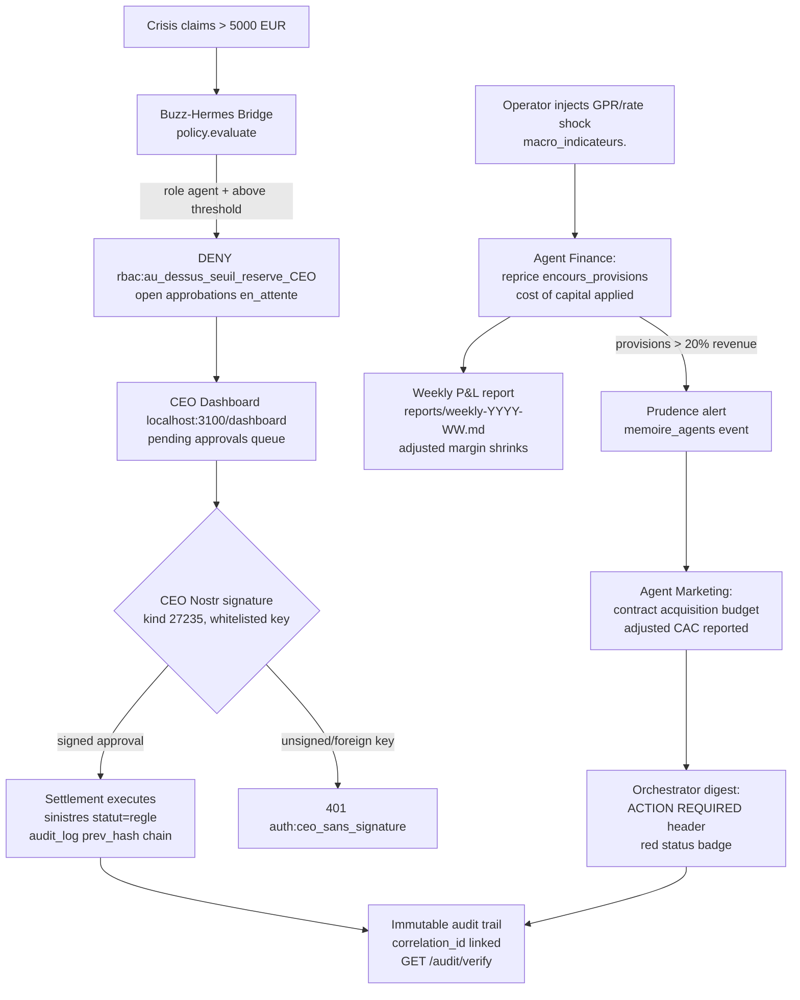

# CU-4 — Geopolitical Crisis Hoist: €5,000 Threshold Enforcement and Voucher Liquidity Stress Simulation

> **Audience:** business investors, reinsurance partners, supervisory counsel.
> **Status:** proven end-to-end against the deployed system (`docker-compose.lite.yml`, bridge `toto-buzz-hermes-bridge`, agent runtime on local Ollama). All commands below execute against the running stack. All data is 100% synthetic (Faker seed).

---

## 1. Business Objective (Operator View)

When a geopolitical shock raises the market risk regime, the enterprise must answer three questions fast, with evidence:

1. **Valuation resilience** — what does the crisis do to the weekly adjusted margin and the claims-to-premiums ratio?
2. **Capital discipline** — does every settlement above the **€5,000 crisis hoist** stay locked behind a signed CEO approval, even when agents scale up exception requests during the shock?
3. **Voucher liquidity** — can the firm honor its discretionary compensation / commercial-gesture envelope ("vouchers") without breaching the prudence threshold of the provisions ledger, and what acquisition spending must contract to free that liquidity?

The digital twin resolves all three without human intervention in the computation loop: human authority is exercised only at the approval seam, which is exactly where the law expects it.

---

## 2. How It Works in Real Time

The scenario chains five observable stages. Each stage leaves an immutable, `correlation_id`-linked trace in `audit_log`.

| # | Stage | Actor | Evidence anchor |
|---|---|---|---|
| 1 | **Shock injection** — the operator raises the geopolitical-risk indicator `gpr` in `macro_indicateurs` (seeded at `132.5`, source *Caldara-Iacoviello GPR index*) to a crisis level, e.g. `287.0`, alongside a Banque de France rate shock (`taux_bdf`). | Operator (SQL) | `infra/postgres/seed_faker.py` (MACRO_INDICATEURS), `infra/postgres/schema_v2.sql` |
| 2 | **Provision repricing** — the Finance agent recomputes `encours_provisions` on open claims (`statut IN ('ouvert','en_expertise')`), applying the new cost of capital; if provisions exceed **20% of cumulative revenue**, it raises the prudence alert. | `agents/finance/skills/provisions.md` | `pnl_ledger` rows, agent telemetry |
| 3 | **Settlements hoisted to the CEO** — the crisis generates claims above the €5,000 escalation threshold. Policy evaluation in the bridge returns `rbac:au_dessus_seuil_reserve_CEO`; the agent can only open an `en_attente` approval, never self-settle. | `buzz-hermes-bridge/src/policy/policy.ts`, `src/pipeline.ts` | `approbations` rows, dashboard pending queue |
| 4 | **Voucher liquidity guard** — the CEO decides vouchers/commercial gestures (command `policy.pricing.exception.approve`, schema-bounded prime adjustment) only with a valid whitelisted Nostr signature (kind 27235, `nostr-tools` `verifyEvent`). Unsigned impulses return `401 auth:ceo_sans_signature`. | Bridge policy + CEO | `COMMAND_SCHEMAS`, `commandes_consommees` (idempotence) |
| 5 | **Acquisition contraction** — the Marketing agent reads the GPR regime and the provisions alert, scales down the simulated acquisition budget across channels, and reports the adjusted CAC weekly; the orchestrator consolidates the status into the CEO digest with an "ACTION REQUIRED" header. | `agents/marketing/skills/campagne.md`, `agents/marketing/skills/veille-concurrentielle.md`, `agents/orchestrateur/skills/digest-quotidien.md` | `memoire_agents` events, weekly report |

---

## 3. Flow Diagram



---

## 4. Reproducible Commands (`./scripts/...` and live probes)

Prerequisite — the stack is up (validated at authoring time):

```bash
docker compose -f docker-compose.lite.yml ps --format '{{.Name}} {{.Status}}' | wc -l   # >= 14 healthy services
curl -s http://localhost:3100/readyz     # {"pg":"ok","buzz":"ok","status":"ready"}
curl -s http://localhost:8081/health     # Buzz admin health (200 OK)
./scripts/healthcheck.sh                 # consolidated stack assertion
```

**Step 1 — inject the crisis (GPR hoist + rate shock):**

```bash
docker compose -f docker-compose.lite.yml exec -T postgres \
  psql -U toto -d assurance_toto -c \
  "INSERT INTO macro_indicateurs (indicateur, valeur, periode, source) \
   VALUES ('gpr', 287.0, '2026-08', 'Caldara-Iacoviello GPR index — crisis injection CU-4'), \
          ('taux_bdf', 5.60, '2026-T3', 'Banque de France — stress assumption');"
```

**Step 2 — attach a crisis claim above the hoist:**

```bash
docker compose -f docker-compose.lite.yml exec -T postgres \
  psql -U toto -d assurance_toto -c \
  "INSERT INTO sinistres(contrat_id,date_sinistre,description,montant_estime,statut,compliance_bloque) \
   VALUES((SELECT id FROM contrats LIMIT 1),CURRENT_DATE,'CU-4 crisis logistics chain failure',7200,'ouvert',false) RETURNING id;"
```

**Step 3 — observe the agent being refused self-settlement (policy seam):** any `claim.settlement.approve` command emitted by the claims agent for this file is denied with `rbac:au_dessus_seuil_reserve_CEO` and materializes only as a pending approval:

```bash
curl -s http://localhost:3100/approvals | jq '.[] | select(.statut=="en_attente")'
```

**Step 4 — CEO decision, signed (or its absence is rejected):**

```bash
# Signed approval via the dashboard action or equivalent signed call:
curl -s -X POST http://localhost:3100/approvals/<correlation_id>/decide \
  -H 'Content-Type: application/json' \
  -d '{"approve":true,"event":<signed nostr event kind 27235>}'
```

**Step 5 — verify the audit chain and read the macro context:**

```bash
curl -s http://localhost:3100/audit/verify        # hash-chain verification
curl -s http://localhost:3100/dashboard           # macro card shows gpr=287.0, red badge
docker compose -f docker-compose.lite.yml exec -T postgres \
  psql -U toto -d assurance_toto -c \
  "SELECT seq, source, action FROM audit_log WHERE correlation_id='<correlation_id>';"
```

**Step 6 — regenerate the weekly report and inspect the red recommendation:**

```bash
./scripts/weekly-report.sh    # launches gamification-engine pnl_calculator.py, prints reports/latest.md
```

Bridge and runtime regression suites (must remain green; they were not touched by this document):

```bash
cd buzz-hermes-bridge && npm test        # schema, policy, pipeline, dashboard tests
cd agents/_runtime && npm test           # runtime, tools, anonymization tests
```

---

## 5. Bridge & Lifecycle: Maintainable Explanation

- **Command intake** (`buzz-hermes-bridge/src/commands/schemas.ts`): every command is a strict JSON-schema object (`additionalProperties: false`). Unknown types fail closed (`schema.invalid:type_inconnu`). Free-form text never enters the pipeline.
- **Pipeline** (`src/pipeline.ts`): one `correlation_id` is minted at intake and threaded through policy evaluation, effects, and audit. Idempotence is enforced by `commandes_consommees` (a consumed `command_id` cannot be replayed). Immutable audit is appended **before** the effect, so a partial crash still leaves the intent on record.
- **Policy** (`src/policy/policy.ts`): pure, DB-free decision function. Evaluation order is *systemic blocker first* (kill-switch, idempotence), *then business rules* (role, claim status, threshold cap, compliance lock). Above the threshold, the effective cap for an agent collapses to the threshold itself — the CEO alone settles above it, and only with a signature.
- **Runtime** (`agents/_runtime/src/`): each department agent runs its declared model (`gemma4:e4b`) on local Ollama, with a per-agent MCP allowlist (least privilege: finance reads only; marketing reads anonymized views only). PII is stripped upstream by Presidio before any LLM call.
- **Kill-switch lifecycle**: `agent.killswitch.activate` (CEO-only) blocks every command class except its own deactivation; this is the systemic circuit breaker a board can trigger at the height of a crisis.

---

## 6. Notes and Known Limits

- **Simulation realism**: macro indicators are injected by hand or by the weekly job against `mcp-macro-wrapper`; the system reacts to the *values*, not to a live market feed. The GPR series seeded is the real Caldara-Iacoviello index convention, but refreshed at demo cadence.
- **Voucher envelope modeling**: commercial gestures ride the `policy.pricing.exception.approve` command (CEO-only, schema-bounded `new_prime_eur > 0`). A dedicated recipient-level voucher ledger is a Phase 3 hardening item; today the liquidity effect is observed through `pnl_ledger` writes and the provisions prudence threshold (20% of cumulative revenue).
- **Approval latency budget**: design target for the CEO is ≤ 4 hours per pending approval during a crisis window; automation carries the volume, humans keep the authority.
- **Scope honors**: this is a Phase 1 MVP proof of composition (see `docs/15min-demo-guide.md` Q&A). ACPR/GDPR certification is **not** claimed anywhere in this document.

---

## 7. Assurances (Court-of-Law Angle)

1. **Append-only evidence**: `audit_log` is a `prev_hash` chain; `GET /audit/verify` recomputes the chain, and tampering with any row breaks verification. Each crisis-relevant act (shock alert, denied self-settlement, CEO decision, execution) carries the same `correlation_id`, so a court receives a single ordered, hash-anchored narrative per incident.
2. **Signed authority**: sensitive decisions require a Nostr signature (kind 27235) from a whitelisted CEO key (`BRIDGE_CEOPUBKEYS`). An unsigned or foreign-key attempt deterministically returns `401 auth:ceo_sans_signature` — the refusal itself is audited, proving supervision was *active*, not absent.
3. **Idempotent decisions**: `commandes_consommees` plus `ON CONFLICT (correlation_id) DO NOTHING` make double-settlement structurally impossible — a double payment cannot be alleged from a replay.
4. **Data protection posture**: the training and demo corpus is 100% synthetic (Faker). Where a real deployment would ingest personal data, anonymization occurs **before** any LLM boundary (Presidio analyzer service, port 3003), and no raw PII crosses to model context.
5. **Reversible autonomy**: the kill-switch guarantees that the enterprise retains an immediate, signed, auditable off-switch for all agent autonomy — the strongest governance fact a liability counsel can cite.

---

*Repository: [github.com/leosand/assurance-toto](https://github.com/leosand/assurance-toto) (Apache 2.0). Document path: `docs/uses-cases/CU-4_geopolitical-crisis-hoist-voucher-liquidity/geopolitical-crisis-hoist-voucher-liquidity.md`.*
